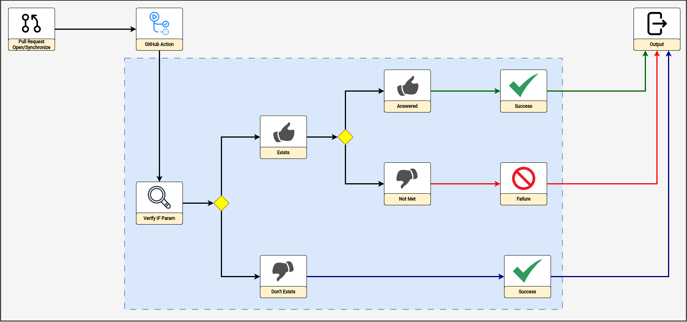

# action-validate-param-pr

> Documentation available in Portuguese (pt-BR) [here](./docs/README_pt-BR.md).

## Index

- [Description](#description)
- [Flow](#flow)
- [Requirements](#requirements)
- [Use](#use)
  - [GitHub App](#github-app)
  - [Personal Access Token (PAT)](#personal-access-token-pat)
- [Output](#output)
- [Contribute to the Project](#contribute-to-the-project)

## Description

Action useful for validating the check-box in Pull Requests, or another strategy that conditions a certain action or scenario.

For example, an indication of the development of a new feature requires documentation to be updated.

## Flow



## Requirements

- [GitHub](https://github.com/) token so that the action can carry out validation interactions via the [GitHub API](https://docs.github.com/en/rest?apiVersion=2022-11-28);

- `conditionalValue`: Value of the conditional that must be "fetched" by the action;

- `valueThatMustExist`: Value or condition that must exist.

## Use

### [GitHub App](https://docs.github.com/en/apps)

1. Create directory `.github/worfklows` in the root of your project;

2. Create file `validate-param-pr.yaml` with content similar to the following:

> NOTE: Check the guidelines for using the "action-generate-token-github-app" action by clicking [here](https://github.com/padupe/action-generate-token-github-app#requirements).

```yaml
name: Validate Param at Pull Request
on:
  pull_request:
    types: [opened, reopened, synchronize]
    branches:
      - main

jobs:
  validate-param-pr:
    runs-on: ubuntu-latest
    steps:
      - name: Generate Token from GitHub App
        id: generate-token-github-app
        uses: padupe/action-generate-token-github-app@1.1.3
        with:
          appId: ${{ secrets.CREDENTIALS_GITHUB_APP_ID }}
          installationId: ${{ secrets.CREDENTIALS_GITHUB_APP_INSTALLATION_ID }}
          privateKey: ${{ secrets.CREDENTIALS_GITHUB_APP_PRIVATE_KEY }}

      - name: Validate Param at Pull Request
        uses: padupe/action-validate-param-pr@1.0.0
        with:
          gitHubToken: ${{ steps.generate-token-github-app.outputs.gitHubToken }}
          conditionalValue: '[x] Release'
          valueThatMustExist: '[x] Docs'
```

### Personal Access Token (PAT)

1. Create directory `.github/worfklows` in the root of your project;

2. Create file `validate-param-pr.yaml` with content similar to the following:

```yaml
name: Validate Param at Pull Request
on:
  pull_request:
    types: [opened, reopened, synchronize]
    branches:
      - main

jobs:
  validate-param-pr:
    runs-on: ubuntu-latest
    steps:
      - name: Validate Param at Pull Request
        uses: padupe/action-validate-param-pr@1.0.0
        with:
          gitHubToken: ${{ secrets.PAT_TOKEN }}
          conditionalValue: '[x] Release'
          valueThatMustExist: '[x] Docs'
```

## Output

Boolean value.

## Contribute to the Project

Check our [CONTRIBUTING](./CONTRIBUTING.md) guidelines.
