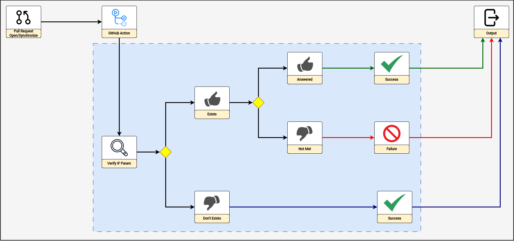

# action-validate-param-pr

## Índice

- [Descrição](#descrição)
- [Fluxo](#fluxo)
- [Requisitos](#requisitos)
- [Uso](#uso)
  - [GitHub App](#github-app)
  - [_Personal Access Token (PAT)_](#personal-access-token-pat)
- [_Output_](#output)
- [Contribua com o Projeto](#contribua-com-o-projeto)

## Descrição

_Action_ útil para validação de _check-box_ em Pull Requests, ou outra estratégia, que condicione determinada ação ou cenário.

Por exemplo, uma indicação de desenvolvimento de uma nova funcionalidade requer a atualização de documentação.

## Fluxo



## Requisitos

- _Token_ do [GitHub](https://github.com/) para que a _action_ possa realizar as interações para validação via [API do GitHub](https://docs.github.com/pt/rest?apiVersion=2022-11-28);

- `conditionalValue`: Valor da condicional que deve ser "buscado" pela _action_;

- `valueThatMustExist`: Valor ou condição que deve existir.

## Uso

### [GitHub App](https://docs.github.com/pt/apps)

1. Crie o diretório `.github/workflows` na "raiz" do seu projeto;

2. Crie o arquivo `content-change-validation.yaml` com o conteúdo semelhante ao apresentado a seguir:

> OBSERVAÇÃO: Confira as orientações para uso da action "action-generate-token-github-app" clicando [aqui](https://github.com/padupe/action-generate-token-github-app/blob/master/docs/README.pt-BR.md#requisitos).

```yaml
name: Validate Param at Pull Request
on:
  pull_request:
    types: [opened, reopened, synchronize]
    branches:
      - main

jobs:
  validate-param-pr:
    runs-on: ubuntu-latest
    steps:
      - name: Generate Token from GitHub App
        id: generate-token-github-app
        uses: padupe/action-generate-token-github-app@1.1.3
        with:
          appId: ${{ secrets.CREDENTIALS_GITHUB_APP_ID }}
          installationId: ${{ secrets.CREDENTIALS_GITHUB_APP_INSTALLATION_ID }}
          privateKey: ${{ secrets.CREDENTIALS_GITHUB_APP_PRIVATE_KEY }}

      - name: Validate Param at Pull Request
        uses: padupe/action-validate-param-pr@1.0.0
        with:
          gitHubToken: ${{ steps.generate-token-github-app.outputs.gitHubToken }}
          conditionalValue: '[x] Release'
          valueThatMustExist: '[x] Docs'
```

### _Personal Access Token_ (PAT)

1. Crie o diretório `.github/workflows` na "raiz" do seu projeto;

2. Crie o arquivo `content-change-validation.yaml` com o conteúdo semelhante ao apresentado a seguir:

```yaml
name: Validate Param at Pull Request
on:
  pull_request:
    types: [opened, reopened, synchronize]
    branches:
      - main

jobs:
  content-change-validation:
    runs-on: ubuntu-latest
    steps:
      - name: Validate Param at Pull Request
        uses: padupe/action-content-change-validation@1.1.4
        with:
          gitHubToken: ${{ secrets.PAT_TOKEN }}
          conditionalValue: '[x] Release'
          valueThatMustExist: '[x] Docs'
```

## _Output_

Valor _booleano_.

## Contribua com o Projeto

Confira nosso guia para [CONTRIBUIÇÃO](./CONTRIBUTING.pt-BR.md).
